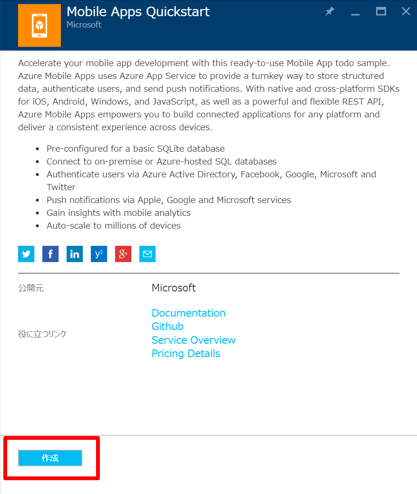
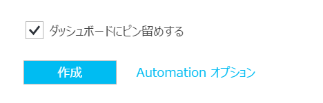
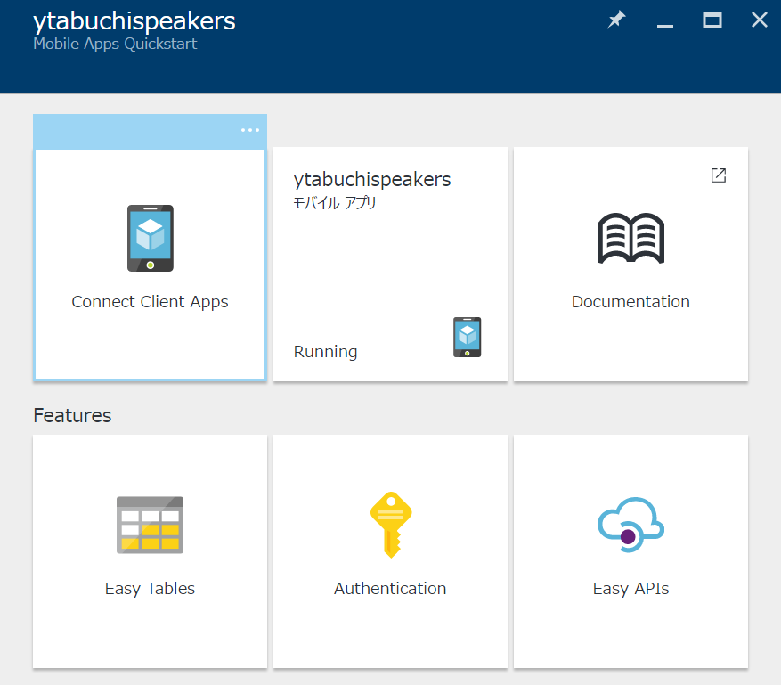
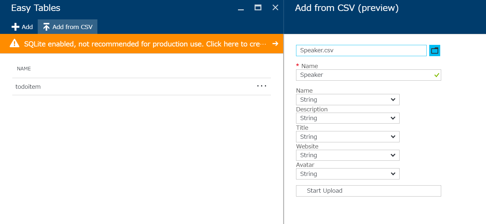

# Xamarin Dev Days ハンズオン手順書

これは、Xamarin.Forms と MSのクラウドサービス Microsoft Azure を使った簡単なアプリを作るハンズオンです。

Microsoft 本社の Xamarin チームが作った、詳細なハンズオン手順書『[Xamrin Dev Days Hands On Lab](https://github.com/xamarin/dev-days-labs/tree/2016/HandsOnLab)』の日本語訳版をここに載せます。


## 今回 何を作るの？

| 項目                       | 値                                                            |
|----------------------------|---------------------------------------------------------------|---|
| どんなアプリ？             | Xamarin Dev Days の本社スピーカーと、その人の詳細を表示するアプリ |
| どんなアプリ？(技術的視点) | Microsoft Azure に接続された Xamarin.Forms で作るアプリ       |

## 開発環境

Windows でも Mac でも良いです。

|OS|OS のバージョン|要インストール済|
|----|----|----|
|Windows|Windows 10|Visual Studio 2015 Update 3|
|Mac OS X|10.11 ("El Capitan") 以降 |Xamarin Studio, 最新の Xcode |

ことわり：    
この手順書はスクリーンショット盛り盛りでお送りしますが、Visual Studio でのスクリーンショットのみとさせていただきます。 Xamarin Studio でもだいたい似た感じなので大丈夫です。

# さぁ手を動かそう！

まず、[ハンズオンのレポジトリ](https://github.com/xamarin/dev-days-labs/tree/2016/HandsOnLab) を開いておいてください。    
[https://github.com/xamarin/dev-days-labs/tree/2016/HandsOnLab](https://github.com/xamarin/dev-days-labs/tree/2016/HandsOnLab)

## 手順 1 ：ソリューションファイルを開く

[Start ディレクトリ](https://github.com/xamarin/dev-days-labs/tree/2016/HandsOnLab/Start) の中にある「`DevDaysSpeakers.sln`」を開いてください。  
（Windows の場合は Visual Studio、Mac OS の場合は Xamarin Studio で開きます。）

ソリューションタブを見ると、4つのプロジェクトで構成されているのが分かります。

|#|プロジェクト名|概要|実行環境|
|----|----|----|----|
|1 | `DevDaysSpeakers (Portable)`|共通コード部分 (model とか view とか view model とか) が全部入った PCL (Portable Class Library )。|（不問）|
|2 | `DevDaysSpeakers.Droid`|Android アプリケーション|（不問）|
|3 | `DevDaysSpeakers.iOS`|iOS アプリケーション|実行には Mac が必要|
|4 | `DevDaysSpeakers.UWP`|Windows 10 UWP アプリケーション|実行には Windows 10 & VS 2015 が必要|


共通部分である `DevDaysSpeakers (Portable)` プロジェクトの中に、空白の XAMLページ ([View/DetailsPage.xaml](https://github.com/xamarin/dev-days-labs/blob/master/HandsOnLab/Start/DevDaysSpeakers/DevDaysSpeakers/View/DetailsPage.xaml)など) がありますが、    
これはこのハンズオンの中で使うことになるものです。

## 手順 2 : NuGet Restore

すべてのプロジェクトにおいて、必要な NuGet パッケージはすべてインストール済みとなっています。なので、このハンズオンでは、新たにパッケージを追加でインストールする必要はありません。

まず最初に我々がしなければならないことは、インターネットから、すべての NuGet パッケージをリストアすることです。

どうやるかというと、ソリューションタブの中の『ソリューション』を
右クリックして、『`Restore NuGet packages`』をクリックします。


## 手順 3 : Model を いじる

スピーカーの情報を取ってこれるようにするため、 Speaker モデルを作りましょう。

1. `DevDaysSpeakers (Portable)` プロジェクトの中の `DevDaysSpeakers/Model/Speaker.cs` ファイルを開きます。
1. 【コピペ】 Speaker クラスの中に、以下のプロパティを追加してください。

```csharp
public string Id { get; set; }
public string Name { get; set; }
public string Description { get; set; }
public string Website { get; set; }
public string Title { get; set; }
public string Avatar { get; set; }
```

## 手順 4 : View Model を いじる

Xamarin.Forms の view で、どのようにデータを表示するかのすべての機能を、`SpeakersViewModel.cs` が提供します。    
`SpeakersViewModel` は、 Speaker の List と、サーバからスピーカーのデータを取ってくるために呼ばれるメソッド、から構成されています。また、バックグラウンドタスクとしてデータを取って来ようとしていることを示す boolean フラグも持っています。   

### INotifyPropertyChanged をインプリメントしよう

`INotifyPropertyChanged` (= プロパティ値が変更されたことをクライアントに通知するインターフェース) は、 MVVM フレームワークにおいて、重要なデータバインディングです。 それ（INotifyPropertyChanged）は、オブジェクトの状態に変更があった場合に、ユーザーインターフェースが通知を受け取ることができる仕組みを提供します。

今こうなっています：

[Before]
```csharp
public class SpeakersViewModel
{

}
```

これを、こうしてください：

[After]【コピペ】
```csharp
public class SpeakersViewModel : INotifyPropertyChanged
{

}
```

そして    
右クリック → 『`Implement Interface`』をクリック    
で、以下のコードが生えます。

```csharp
public event PropertyChangedEventHandler PropertyChanged;
```

これは、プロパティが変更された時いつでも呼ばれるメソッドです。ということで `OnPropertyChanged` というヘルパーメソッド(helper method)を作る必要が出てきます。

【コピペ】 C# 6
```csharp
void OnPropertyChanged([CallerMemberName] string name = null) =>
    PropertyChanged?.Invoke(this, new PropertyChangedEventArgs(name));
```

(ちなみに、C# 5 (バージョン古い)で書くとこうなります)
```csharp
void OnPropertyChanged([CallerMemberName] string name = null)
{
    var changed = PropertyChanged;

    if (changed == null)
        return;

    changed.Invoke(this, new PropertyChangedEventArgs(name));
}
```

というわけで、我々は、プロパティが更新され時はいつでも `OnPropertyChanged()` を呼ぶことができるようになりました。    
さぁ、我々の最初の、バインディングできるプロパティ (our first bindable property) を作ってみましょう！

### IsBusy プロパティ

この `SpeakersViewModel` クラスの中に、bool値を get/set するための、バッキングフィールド(backing field)と、bool型プロパティのためのアクセサを作りましょう。

まず、バッキングフィールドを作ります。

```csharp
bool busy;
```

そして、自動プロパティを作ります。

```csharp
public bool IsBusy
{
    get { return busy; }
    set
    {
        busy = value;
        OnPropertyChanged();
    }
}
```

`OnPropertyChanged();` を呼んでいますね。これを呼ぶことによって Xamarin.Forms は、IsBusy の値が set された時に、自動的に知ることができます。

### Speaker の ObservableCollection

[メモ]    
`ObservableCollection` (自分の中身が変わったことを検知する仕組みを持っているコレクション)     

[TODO] We will use an ObservableCollection that will be cleared and then loaded with speakers.
なぜ `ObservableCollection` を使うかというと、これは要素(コレクションの中身)を追加とか削除とかすると発火する `CollectionChanged` というイベントを最初から持っているからです。

[TODO] In the class above the constructor simply create an autoproperty:

```csharp
public ObservableCollection<Speaker> Speakers { get; set; }
```

コンストラクタの中で、`ObservableCollection` の新しいインスタンスを作ります。
なので、SpeakersViewModelクラスのコンストラクタはこのようになります：

```csharp
public SpeakersViewModel()
{
    Speakers = new ObservableCollection<Speaker>();
}
```


### GetSpeakers メソッド

我々は今から `GetSpeakers` という名前のメソッドを作ろうとしていますが、これは、インターネットから speaker のデータをすべて取ってくるときに呼ぶメソッドです。    
まずは単純な HTTP リクエストから実装します。でもあとから Azure からデータを取ってきたりこちら(クライアント)から変更して sync できるようにアップデートします！

まず、`GetSpeakers`という名前のメソッドを作ります。型は `async Task` です。

```csharp
async Task GetSpeakers()
{

}
```

これから、この `GetSpeakers` メソッドの中に色々とコードを書いていきます。

まず、既にデータを取得済みかをチェックします。

```csharp
async Task GetSpeakers()
{
    if(IsBusy)
        return;
}
```
次に、 try/catch/finally ブロックのための土台をいくつか作ります。

```csharp
async Task GetSpeakers()
{
    if (IsBusy)
        return;

    Exception error = null;
    try
    {
        IsBusy = true;

    }
    catch (Exception ex)
    {
        error = ex;
    }
    finally
    {
       IsBusy = false;
    }
}
```

`IsBusy` は最初は true にセットしておき、そしてサーバーに接続しようとした時と、終わった時は false にセットします。

そして、`try`ブロックの中で、サーバーから json データを取ってくるために `HttpClient` を使います。

```csharp
using(var client = new HttpClient())
{
    // サーバーから json を取得します
    var json = await client.GetStringAsync("http://demo4404797.mockable.io/speakers");
}
```

引き続き **using** 句の中で、Json.NET を使用して json をデシリアライズし、Speaker のリストに格納します:

```csharp
var items = JsonConvert.DeserializeObject<List<Speaker>>(json);
```

引き続き **using** 句の中で、Speakers をクリアして、リスト内の item を ObservableCollection に読み込ませます:

```csharp
Speakers.Clear();
foreach (var item in items)
    Speakers.Add(item);
```
何か問題があれば **catch** 句で例外を保存し、最後の finally 句でポップアップアラートを表示します:

```csharp
if (error != null)
    await Application.Current.MainPage.DisplayAlert("Error!", error.Message, "OK");
```

完全なコードは次のようになるはずです:

```csharp
async Task GetSpeakers()
{
    if (IsBusy)
        return;

    Exception error = null;
    try
    {
        IsBusy = true;

        using(var client = new HttpClient())
        {
            //サーバーから json を取得します
            var json = await client.GetStringAsync("http://demo4404797.mockable.io/speakers");

            //json をデシリアライズします
            var items = JsonConvert.DeserializeObject<List<Speaker>>(json);

            //リストを Speakers に読み込ませます
            Speakers.Clear();
            foreach (var item in items)
                Speakers.Add(item);
        }
    }
    catch (Exception ex)
    {
        Debug.WriteLine("Error: " + ex);
        error = ex;
    }
    finally
    {
        IsBusy = false;
    }

    if (error != null)
        await Application.Current.MainPage.DisplayAlert("Error!", error.Message, "OK");
}
```

データを取得するメインのメソッドはこれで完成です！

#### GetSpeakers Command

このメソッドを直接実行する代わりに、私たちは **Command** を公開します。Command は実行されるメソッドを知り、任意の Command が実行可能かを説明するインターフェースを持っています。

ObservableCollection<Speaker> Speakers {get;set;} を作成した場所で、**GetSpeakersCommand** Command を作成しましょう:

```csharp
public Command GetSpeakersCommand { get; set; }
```

**SpeakersViewModel()** のコンストラクターの中で GetSpeakersCommand を作成し、使用するメソッドを割り当てます。更に IsBusy プロパティに影響を与える enabled フラグも渡します:

```csharp
GetSpeakersCommand = new Command(
                async () => await GetSpeakers(),
                () => !IsBusy);
```

この後修正するのは、私たちが作成した enabled 関数を再評価する IsBusy プロパティをいつセットするか？です。**IsBusy** の **set** でシンプルに **ChangeCanExecute** メソッドを次のように実行します:

```csharp
set
{
    busy = value;
    OnPropertyChanged();
    //Update the can execute
    GetSpeakersCommand.ChangeCanExecute();
}
```

## ユーザーインターフェース!!!
さて、最初の Xamarin.Forms ユーザーインタフェースとして、*View/SpeakersPage.xaml** を作っていきましょう。

### SpeakersPage.xaml

アプリの最初のページとして、縦にスタックされる(縦に連なって表示される)コントロール群を追加します。初めに、ContentPage の中に、次のように StackLayout を追加します：

```xml
 <StackLayout Spacing="0">

  </StackLayout>
```

今後、この StackLayout に対して、他のコントロールを追加していきます。

次に、既に作成した **GetSpeakersCommand** にバインディングされるボタンを追加します：

```xml
<Button Text="Sync Speakers" Command="{Binding GetSpeakersCommand}"/>
```

このボタンの下に、サーバーからデータを受信しているときに使うローディング バーを表示します。ここでは、ActivityIndicator を使って、既に作ってある IsBusy プロパティにバインディングします：

```xml
<ActivityIndicator IsRunning="{Binding IsBusy}" IsVisible="{Binding IsBusy}"/>
```

Speakers コレクションに ListView をバインディングして、全ての要素を表示します。
また、*x:Name=""* という特別なプロパティを使って、コントロールに名前を付けることができます。ここでは、ListView に ListViewSpeakers という名前を付けています：

```xml
<ListView x:Name="ListViewSpeakers"
              ItemsSource="{Binding Speakers}">
        <!--ここに ItemTemplate を追加-->
</ListView>
```

要素の表示には、個々の要素がどのように表示されるべきかを記述する必要があります。そのためには、 ItemTemplate を使いますが、この ItemTemplate は、何らかの View で表現された DataTemplate を持つ必要があります。
Xamarin.Forms には、いくつかの既定の Cell が定義されていますが、ここでは、一つの画像と、2つのテキストを表示できる、**ImageCell** を使います。

上記のコード内の &lt;!--ここに ItemTemplate を追加--&gt; を、次のコードで置き換えます：

```xml
<ListView.ItemTemplate>
    <DataTemplate>
        <ImageCell Text="{Binding Name}"
                    Detail="{Binding Title}"
                    ImageSource="{Binding Avatar}"/>
    </DataTemplate>
</ListView.ItemTemplate>
```

Xamarin.Forms は、サーバー上の画像を自動的にダウンロード、キャッシュした後、表示します。

### App.cs を確認する

App.cs を開いてみると、そこには、App() のコンストラクタがあり、そこがアプリケーションのエントリ ポイントになっています。この中では、新しい SpeackersPage を作成し、それをナビゲーション ページでラップすることで、タイトル バーを作っています。

### アプリを実行する!

遂に、iOS、Android、あるいは、UWP (Windows/VS2015 のみ) をスタートアップ プロジェクトとして設定し、デバッグを開始することができるようになりました！


#### iOS
PCを使っている場合、アプリの実行・デバッグを行うためには、XamarinがインストールされているmacOSのデバイスに接続する必要があります。

macOSに正しく接続されている場合、接続状態は緑になっています。ターゲットとして、 **iPhoneSimulator** を選択してから、デバッグを行うシミュレータの種類を選択します。


#### Android

DevDaysSpeakers.Droid をスタートアップ プロジェクトとして設定し、実行するシミュレータを選択します。

#### Windows 10

最初に、UWP アプリ用に SQLite 拡張がインストールされていることを確認します：

**ツール->拡張機能と更新プログラム** に移動します。

オンラインの検索で、*SQLite* を検索し、SQlite for Univeral Windows Platform がインストールされていることを確認します。(執筆時のバージョンは、 3.13.0)


確認ができたら、DevDaysSpeakers.UWP をスタートアップ プロジェクトとして設定し、デバッグで、**ローカル コンピューター**を選択します。

## Details (詳細画面)

さて、次に、このページから、ナビゲーションを経て、何らかの Details (詳細画面)を表示してみましょう。
**SpeakersPage.xaml** に対するコード ビハインドである、**SpeakersPage.xaml.cs** を開きます。

### ItemSelected イベント

コード ビハインドの中には、SpeakersViewModel に対する設定があります。項目が選択されたときに通知されるように、**BindingContext = vm;** の下に、**ListViewSpeakers** へのイベントを追加します。

```csharp
ListViewSpeakers.ItemSelected += ListViewSpeakers_ItemSelected;
```

そして、DetailsPage へナビゲートされるように、ListViewSpeakers_ItemSelected を作成します：

```csharp
private async void ListViewSpeakers_ItemSelected(object sender, SelectedItemChangedEventArgs e)
{
    var speaker = e.SelectedItem as Speaker;
    if (speaker == null)
        return;

    await Navigation.PushAsync(new DetailsPage(speaker));

    ListViewSpeakers.SelectedItem = null;
}
```

上のコードでは、最初に選択されている項目が null でないことを確認してから、**Navigation** API を使って、新しく作ったページをプッシュし、最後に、項目の選択を解除します。

### DetailsPage.xaml

さて、Details ページを作っていきます。
SpeakersPage と同じように StackLayout を使いますが、ここでは、テキストが長すぎる場合にスクロールできるように、StackLayout を ScrollView で囲みます。

```xml
  <ScrollView Padding="10">
    <StackLayout Spacing="10">
     <!-- 詳細画面のコントロール群をここに書く -->
    </StackLayout>    
  </ScrollView>
```

そして、Speaker オブジェクトのプロパティに対応するコントロールと、バインディングを追加します：

```xml
<Image Source="{Binding Avatar}" HeightRequest="200" WidthRequest="200"/>

<Label Text="{Binding Name}" FontSize="24"/>
<Label Text="{Binding Title}" TextColor="Purple"/>
<Label Text="{Binding Description}"/>
```

さらに、ちょっとだけ面白くするために、2つのボタンを追加します。これらのボタンには、この後、コード ビハインドでクリック時のイベントを追加します：

```xml
<Button Text="読み上げる" x:Name="ButtonSpeak"/>
<Button Text="ウェブサイトに移動" x:Name="ButtonWebsite"/>
```

### 読み上げる

**DetailsPage.xaml.cs** を開いて、2つのクリック ハンドラを足しますが、ここでは、ButtonSpeak から始めます。
このハンドラでは、 [Text To Speech Plugin](https://github.com/jamesmontemagno/TextToSpeechPlugin) を使って、スピーカーの詳細を読み上げるようにします。

コンストラクタの BindingContext の下で、クリック ハンドラを追加します：

```csharp
ButtonSpeak.Clicked += ButtonSpeak_Clicked;
```

クリック ハンドラでは、Text To Speech のクロス プラットフォームな API を呼び出します：

```csharp
private void ButtonSpeak_Clicked(object sender, EventArgs e)
{
    CrossTextToSpeech.Current.Speak(this.speaker.Description);
}
```

### ウェブサイトに移動
Xamarin.Forms には、URL を既定のブラウザで開くためのクロス プラットフォームな機能が搭載されています。

今度は、ButtonWebsite のクリック ハンドラを追加します：

```csharp
ButtonWebsite.Clicked += ButtonWebsite_Clicked;
```

そして、Device キーワードを用いて、OpenUri メソッドを呼び出します：

```csharp
private void ButtonWebsite_Clicked(object sender, EventArgs e)
{
    if (speaker.Website.StartsWith("http"))
        Device.OpenUri(new Uri(speaker.Website));
}
```

### コンパイル & 実行
ここまでできたら、残りの微調整をして、前と同じようにコンパイル、実行できるようにします。

## Azure Mobile Apps に接続します

もちろん RESTful なエンドポイントからデータを取得できることは大事ですがフル機能のバックエンドについてはどうでしょうか？そこで Azure Mobile Apps ですよ！それでは私たちのアプリケーションを Azure Mobile Apps バックエンドを使うようにアップグレードしていきましょう。

[http://portal.azure.com](http://portal.azure.com) にアクセスし、アカウントを取得します。

ポータルにアクセスしたら、**+ 新規** ボタンを選択し、**mobile apps** を検索します。下の図のように検索結果が表示されますので、**Mobile Apps Quickstart** を選択します。


Quickstart のブレードが開くので、**作成** をクリックします。



4つの設定項目がある設定ブレードが開きます:

**アプリ名**

これはアプリのバックエンドを設定するのに必要な一意のアプリ名です。グローバルで一意の名前が必要です。例えば *yourlastnamespeakers* などを試してみてください。

**サブスクリプション**

サブスクリプションを選択するか、従量課金のアカウントを作成します。(このサービスでは課金は発生しません)

**リソースグループ**

*新規作成* を選択し、**DevDaysSpeakers** と入力します。

リソースグループは後で関連のあるサービスを一度に簡単に削除するためのグループです。

**App Service プラン/場所**

このフィールドをクリックして **新規作成** を選択し、一意の名前を付けます。場所 (通常は近い場所を選択します) を選択し、F1 Free の価格レベルを選択します:

> 注: **価格レベルを選択** ブレードの右上にある **すべて表示** をクリックすると F1 Free の価格レベルが表示され選択できるようになります。


最後に **ダッシュボードにピン留めする** をチェックし、［作成］をクリックします:



Mobile Apps のセットアップが完了するまでに 3～5 分ほど掛かります。コードに戻りましょう！


### App.cs のアップデート
Azure バックエンドを私たちのモバイルアプリに追加するために、以前のプレゼンテーションで見た [Azure App Service Helpers library](https://www.nuget.org/packages/AppService.Helpers/1.1.1-beta) のたった4行のコードを使用します。

DevDaysSpeakers/App.cs ファイルの Azure Client のコンストラクターの上に、Static プロパティを追加しましょう:

```csharp
public static IEasyMobileServiceClient AzureClient { get; set; }
```

コンストラクターに、クライアントを作成し、テーブルを登録する以下のシンプルな行を追加します:

```csharp
AzureClient = EasyMobileServiceClient.Create();
AzureClient.Initialize("https://YOUR-APP-NAME-HERE.azurewebsites.net");
AzureClient.RegisterTable<Model.Speaker>();
AzureClient.FinalizeSchema();
```

「YOUR-APP-NAME-HERE」をあなたの指定したアプリ名でアップデートしていることを確認してください。


### SpeakersViewModel.cs のアップデート

ViewModel で、テーブルの参照を取得する別の Private プロパティを追加しましょう。コンストラクターの上に追加します:

```csharp
ITableDataStore<Speaker> table;
```

コンストラクター内で Static の AzureClient を使用してテーブルを取得します:

```csharp
table = App.AzureClient.Table<Speaker>();
```

#### async Task GetSpeakers() のアップデート

次に、HttpClient の呼び出しの中で、テーブルのクエリを取得しましょう:

*try* ブロックのコードを以下のように修正します:

```csharp
 try
{
    IsBusy = true;

    var items = await table.GetItemsAsync();

    Speakers.Clear();
    foreach (var item in items)
        Speakers.Add(item);
}
```

これで私たちのアプリに必要な実装がすべて終了しました！素晴らしいですよね！たった7行のコードです！

Azure portal に戻りデータベースを見てみましょう。

Quickstart が終了したら、以下の画面が見えるはずです。または、ダッシュボードのピンをタップしても行けます:



**Features** 内の **Easy Tables** を選択します。

作成済みの todoitem が見えるはずですが、ここでは新しいテーブルを作成し、デフォルトのデータセットを **Add from CSV** からアップロードすることで作成します。

このレポジトリをダウンロードし、**Speaker.csv** がフォルダにあることを確認してください。

ファイルを選択すると、新しいテーブル名が追加され、フィールドを探して追加してくれます。その後、Start Upload をクリックします。



さあ、アプリケーションを再度実行してみましょう。Azure のデータが取得できているはずです！


## 宿題

二つの宿題でDev Daysをさらに進めましょう。

### 宿題1: Cognitive Services

[Cognitive Serivce Emotion API](https://www.microsoft.com/cognitive-services/en-us/emotion-api)を使い、詳細ページに話し手の表情から幸福度を解析するボタンを追加しましょう。

http://microsoft.com/cognitive からアカウントとAPIキーを取得し、以下の手順を踏んでください。

1.) **Microsoft.ProjectOxford.Emotion** を全プロジェクトに追加する

2.) `EmotionService`クラスを追加する (GetHappinessAsync の中の API キーは直してください)

```csharp
public class EmotionService
{
    private static async Task<Emotion[]> GetHappinessAsync(string url)
    {
        var client = new HttpClient();
        var stream = await client.GetStreamAsync(url);
        var emotionClient = new EmotionServiceClient("INSERT_EMOTION_SERVICE_KEY_HERE");

        var emotionResults = await emotionClient.RecognizeAsync(stream);

        if (emotionResults == null || emotionResults.Count() == 0)
        {
            throw new Exception("Can't detect face");
        }

        return emotionResults;
    }

    //複数の被検対象が存在する場合の平均幸福度算出
    public static async Task<float> GetAverageHappinessScoreAsync(string url)
    {
        Emotion[] emotionResults = await GetHappinessAsync(url);

        float score = 0;
        foreach (var emotionResult in emotionResults)
        {
            score = score + emotionResult.Scores.Happiness;
        }

        return score / emotionResults.Count();
    }

    public static string GetHappinessMessage(float score)
    {
        score = score * 100;
        double result = Math.Round(score, 2);

        if (score >= 50)
            return result + " % ヽ（ヽ *ﾟ▽ﾟ*）ノ";
        else
            return result + "% （；＿；）";
    }
}
```

3.) 詳細ページにボタンを追加し、 **x:Name="ButtonAnalyze** と指定する

4.) クリックのハンドラを追加し、`async`キーワードを指定する

5.) 以下のコードを実行する

```csharp
var level = await EmotionService.GetAverageHappinessScoreAsync(this.speaker.Avatar);
```

6.) ポップアップアラートを表示する
```csharp
await DisplayAlert("Happiness Level", EmotionService.GetHappinessMessage(level), "OK");
```

### 宿題2: 話し手の詳細を編集する

ここでは話し手の肩書きを編集可能にします。

`DetailsPage.xaml`を開き、肩書きを表示している`Label`

```xml
<Label Text="{Binding Title}" TextColor="Purple"/>
```

を以下のような`OneWay`データバインディングを持つ`Entry`に変更し、`Name`を指定してください。

`OneWay`にすると、テキストを入力しても実際のデータは変更されません。

```xml
<Entry Text="{Binding Title, Mode=OneWay}"
             TextColor="Purple"
             x:Name="EntryTitle"/>
```

保存ボタンを「ウェブサイトに行く」ボタンの下に追加しましょう。

```xml
<Button Text="Save" x:Name="ButtonSave"/>
```

#### SpeakersViewModelを更新する

`SpeakersViewModel`を開き、話し手を同期し、リストを更新する`UpdateSpeaker(Speaker speaker)`メソッドを追加します。

```csharp
 public async Task UpdateSpeaker(Speaker speaker)
{
    await table.UpdateAsync(speaker);
    await table.Sync();
    await GetSpeakers();
}
```

#### DetailsPage.xaml.csを更新する

SpeakersViewModelを受け取るようにDetailsPageのコンストラクタを変更しましょう。

変更前:
```csharp
Speaker speaker;
public DetailsPage(Speaker item)
{
    InitializeComponent();
    this.speaker = item;
    ...
}
```
変更後:
```csharp
Speaker speaker;
SpeakersViewModel vm;
public DetailsPage(Speaker item, SpeakersViewModel viewModel)
{
    InitializeComponent();
    this.speaker = item;
    this.vm = viewModel;
    ...
}
```

`ButtonSave`のためのハンドラを追加します。

```csharp
ButtonSave.Clicked += ButtonSave_Clicked;
```

ボタンがクリックされたとき、話し手を更新・保存し前のページに戻ります。

```csharp
private async void ButtonSave_Clicked(object sender, EventArgs e)
{
    speaker.Title = EntryTitle.Text;
    await vm.UpdateSpeaker(speaker);
    await Navigation.PopAsync();
}
```

最後に、`ListViewSpeakers_ItemSelected`で`SpeakersPage.xaml.cs`へ飛ぶときにViewModelを渡すようにする必要があります。

```csharp
//ビューモデルを渡す。
await Navigation.PushAsync(new DetailsPage(speaker, vm));
```

できあがり！
